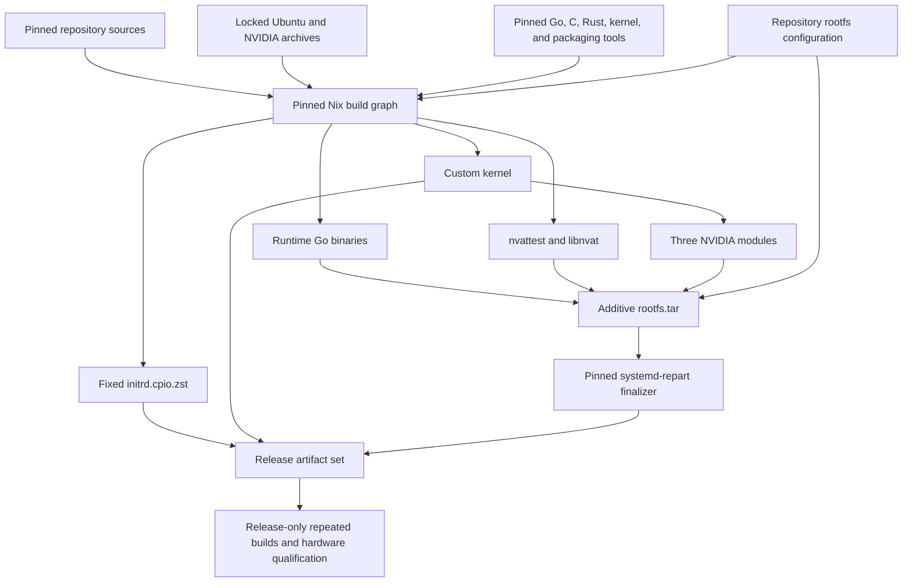

# Image build

The image build has one implementation boundary:

1. Nix builds every content input, runs source checks, and produces the final
   partitioned image.

The builder is trusted. Nix is used to make inputs, dependencies, and assembly
explicit and reproducible, not to attest intermediate artifacts or to verify a
second hidden construction of the same filesystem.

## Graph



There is no Docker builder, Bazel packaging layer, generated manifest
language, artifact cache protocol, or digest handoff between these steps.

## Nix ownership

The top-level `default.nix` pins one Nixpkgs source and exposes the complete set
of image inputs:

| Output | Owner | Declaration |
| --- | --- | --- |
| Runtime and debug Go binaries | Nixpkgs `buildGoModule` | `nix/go.nix`, `tinfoil/go.mod`, `tinfoil/go.sum` |
| Fixed initrd | Nix-built Go CPIO writer and Zstandard | `nix/initrd.nix`, `image/initrd/writer.go` |
| Custom kernel | Nixpkgs `linuxManualConfig` | `nix/kernel.nix`, `kernel/tinfoil-cvm-7.0.defconfig`, `kernel/config.d/10-tinfoil-cvm-policy.config` |
| Three NVIDIA modules | Nixpkgs kernel-module build | `nix/nvidia-modules.nix` |
| nvattest and libnvat | Nixpkgs CMake and Rust builders | `nix/nvattest.nix`, `nix/locks/regorus.Cargo.lock` |
| Ubuntu package payloads | Nixpkgs `debClosureGenerator` and fixed-output fetches | `nix/runtime-packages.nix`, `nix/runtime-packages-lock.nix` |
| NVIDIA, Docker, and debug payloads | Fixed-output archive fetches | `nix/runtime-sources.nix` |
| Repository configuration | Direct additive copy | `image/rootfs/` |
| Rootfs and debug layer archives | Fixed tar materializer | `nix/rootfs.nix` |
| Shipping and debug disk images | Nix-owned fakeroot and `systemd-repart` | `nix/image.nix`, `repart.d/` |

Go binaries and Go validation use the same Nixpkgs Go 1.25 toolchain. The
three NixOS-only patches that prepend Nix-store paths for timezone, MIME, and
IANA databases are omitted so measured guest binaries retain upstream Linux
lookup paths and contain no Nix-store references. All other Nixpkgs Go patches
and the upstream `buildGoModule` machinery remain unchanged.

CI and release builders install the official Nix 2.35.1 binary release pinned
by `nix/nix-version`, `nix/nix-x86_64-linux.sha256`, and the expected Nix store
path. The installer refuses a pre-existing, unverified Nix installation. Box3,
INF14, and release qualification builders must use the same official release
for both the client and daemon, with `sandbox = true`,
`sandbox-fallback = false`, `restrict-eval = true`, and
`allowed-uris = https://github.com/NixOS/nixpkgs/archive/`. A sandbox setup
failure therefore stops the build rather than changing its isolation boundary,
and the only network input permitted at evaluation time is the hash-pinned
Nixpkgs archive, so an unpinned evaluation-time fetch fails closed. Under
restricted evaluation, invocations pass `-I .` from the repository root to
allow reading the repository itself. The remaining host prerequisites
are an x86_64 Linux host with systemd, `sudo`, `curl`, `tar`, `xz`, and the
kernel features required by the Nix sandbox. GitHub runner images may float.
Artifact construction runs inside the Nix sandbox.

The pinned Nixpkgs source is imported with an empty configuration and no
overlays. Developer or machine-local Nixpkgs configuration is not part of the
build graph.

`nix/rootfs.nix` is additive: it starts from an empty tree and installs only
the declared archive members, Nix-built outputs, and repository files. Package
maintainer scripts do not run and no producer filesystem is copied into the
image. Complete package payloads are accepted where they are the clearest
contract; later TCB reduction should remove them only with evidence that the
smaller contract is correct.

The Nix expressions also reject store references in runtime binaries and use
fixed ownership, modes, archive ordering, and timestamps. Reproducibility is a
property demonstrated by repeated clean builds and cross-host comparison; it
is not inferred merely from using Nix.

## Image finalization

`nix/image.nix` extracts the rootfs and optional debug layer within one
fakeroot session, then invokes the pinned Nixpkgs `systemd-repart` directly.
It receives only:

- `rootfs.tar`;
- the debug rootfs layer for `debug-image`; and
- the fixed partition definitions and seed in `repart.d/`;
- the Nix-built kernel and initrd.

It performs no package installation or network access. The derivation creates
the root filesystem, partition table, dm-verity metadata, and one validated
artifact directory. Missing, duplicate, or malformed root-hash output fails
the build.

The disk contains only a fixed 2 GiB ext4 root partition and the exact
dm-verity hash partition calculated by `systemd-repart`. QEMU supplies the
kernel, initrd, and firmware directly, so the image has no empty ESP. The build
fails if the additive rootfs does not fit the fixed root partition.

## Build interface

The supported interface is the named Nix outputs:

```sh
nix-build -I . -A rootfs-archive -o result-rootfs
nix-build -I . -A shipping-image -o result
nix-build -I . -A debug-image -o result-debug
nix-build -I . -A checks
```

Focused producer outputs such as `runtime-go`, `kernel-artifacts`,
`nvidia-modules`, `nvattest`, and `initrd` remain directly buildable. There is
no task-runner layer and deleting result symlinks or collecting the Nix store
is a separate host operation.

Every external input of a target is a fixed-output derivation in its closure:
a fetch that declares its expected hash before the sandbox permits network
access. Enumerate them all, with their hashes, from the instantiated
derivation graph:

```sh
drv="$(nix-instantiate -I . -A shipping-image)"
nix --extra-experimental-features nix-command derivation show -r "$drv" \
  | jq -r '.derivations | to_entries[]
      | select(.value.outputs.out.hash?)
      | [(.value.env.urls // .value.env.url // .value.name),
         .value.outputs.out.hash] | @tsv' \
  | sort -u
```

An empty hash column cannot occur: a derivation without a declared output
hash builds with no network access at all.

Regenerate the reviewed Ubuntu package lock only when changing package inputs
or snapshot indexes:

```sh
nix-build --option sandbox true -I . -A runtime-package-lock -o result-package-lock
cp --no-preserve=mode result-package-lock nix/runtime-packages-lock.nix
rm result-package-lock
```

## Release qualification

Normal pull-request CI checks evaluation, focused builds, and source tests. It
does not rebuild expensive producers twice. Before promoting a release, build
the exact candidate independently on the qualified builders, compare the
kernel, initrd, rootfs, raw disk, and dm-verity root, then boot and exercise the
same artifacts on the required CPU and GPU hardware. Promote only the tested
measurement. This is a release process, not another verifier embedded in the
build graph.
