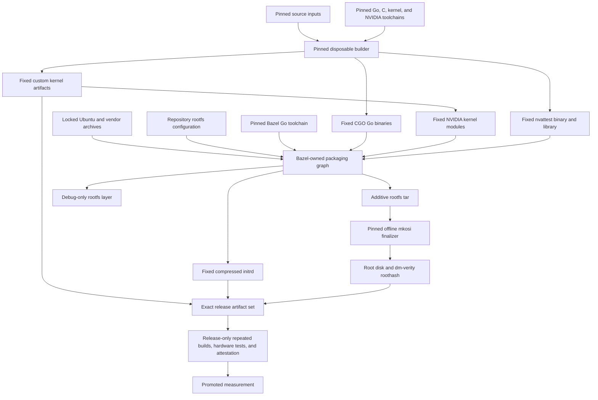

# Build boundary

The image build deliberately uses three tools with separate ownership. The
pinned disposable builder compiles artifacts that do not fit cleanly in Bazel yet,
Bazel assembles the measured filesystem inputs, and mkosi creates the final
root disk and dm-verity metadata.

This is a declarative, pinned build graph. It is not a claim that Bazel builds
the complete image, that every action is hermetic, or that Bazel itself proves
full-image reproducibility.

## Nix Go and initrd producer

The next release builds the five CGO runtime commands, compile-time debug PID1,
pure-Go initrd command, fixed CPIO writer, and compressed initrd through the
top-level `default.nix`. This boundary uses one checksum-pinned Nixpkgs source
and Nixpkgs' `buildGoModule` implementation with the checksum-pinned upstream
Go toolchain. It does not invoke Docker, Bazel, Make, or mkosi.

Build the runtime commands or initrd with `nix-build`:

```sh
nix-build --option sandbox true -A runtime-go
nix-build --option sandbox true -A debug-init
nix-build --option sandbox true -A initrd
```

The CGO outputs retain the measured Ubuntu runtime ABI: they request
`/lib64/ld-linux-x86-64.so.2`, have no effective runtime search path, and are
required by Nix to contain no store references. The initrd command is static.
The fixed writer runs its existing unit tests while it builds and emits
`initrd.cpio.zst` directly from that command and pinned Zstandard. The
`debug-init` derivation enables only the `tinfoil_debug_image` build tag. The
existing Go test job runs the tag-specific PID1 tests before these artifacts
are accepted.

This PR establishes the producer boundary but does not switch the current
rootfs or shipping-image consumers. That cutover belongs with Nix ownership of
the additive rootfs, so no intermediate adapter or duplicated staging protocol
is introduced here.

## Graph



There is no content-addressed artifact service between the builder and Bazel.
The builder publishes a small fixed set of worktree-local files, and Bazel
consumes those files as explicit packaging inputs.

## Ownership

### Pinned builder

`builder/Dockerfile` pins the Ubuntu base digest, dated package snapshot, and
build tool versions. `builder/run.sh` exposes only fixed producer names and
fixed output paths.

The builder owns:

- five CGO runtime commands: `tinfoil-boot`, `tinfoil-container-status`,
  `tinfoil-egress`, `tinfoil-init`, and `tinfoil-shim`;
- the custom kernel;
- three fixed NVIDIA modules; and
- `nvattest` plus its required `libnvat` shared library.

The fixed handoff paths are:

| Producer output | Worktree path |
| --- | --- |
| CGO Go binaries | `build/builder-work/output/artifacts/` |
| Kernel | `kernel/out/` |
| NVIDIA modules | `kernel/out/rootfs-artifacts/nvidia-modules/` |
| nvattest | `build/rootfs-artifacts/nvattest/` |

Package installation and maintainer scripts may run in this environment. Its
filesystem is disposable and is never copied into the runtime image. Only the
named output files are eligible Bazel inputs. The NVIDIA producer alone uses
its documented build-time privileges.

Normal image builds require existing nvattest outputs because rebuilding them
is expensive. `make regenerate-nvattest` is the explicit producer operation.
There is no nvattest output digest protocol, artifact cache identity layer, or
second builder verifier.

#### NVIDIA modules

`kernel/build-nvidia-open-local.sh` builds exactly `nvidia.ko`,
`nvidia-uvm.ko`, and `nvidia-modeset.ko`. It pins the NVIDIA source packages
and host toolchain versions, uses the pinned custom Linux 7.0 source tree,
fixes the kernel build environment, and builds serially. Before publication it
checks each module's vermagic and selected symbol CRCs against the custom
kernel.

This is the only shared builder producer that receives `CAP_SYS_ADMIN`. The
capability is used for the fixed mount namespace and bind mounts required by
the canonical module build; the builder receives no host devices. Package
installation and maintainer scripts remain confined to the disposable builder
filesystem.

The producer publishes only the three named modules beneath
`kernel/out/rootfs-artifacts/nvidia-modules`. The checked-in
`//kernel/out/rootfs-artifacts/nvidia-modules:modules` filegroup exposes them to
Bazel, which installs them at `/usr/lib/tinfoil/kernel-modules`. Temporary
source trees, package state, compiler caches, logs, and other builder contents
are not eligible rootfs inputs. Cached NVIDIA source packages are verified
against their committed SHA-256 values before each build.

### Bazel

Bazel owns:

- the pure-Go initrd command and fixed CPIO/Zstandard packaging action;
- resolution and extraction of the locked Ubuntu package closure;
- pinned Docker and NVIDIA userspace archives;
- rootfs paths, ownership, modes, links, and archive metadata;
- the additive rootfs tar;
- the debug-only rootfs layer; and
- focused Go and initrd tests.

`//image:rootfs` packages complete declared payloads, repository configuration,
and the fixed external producer outputs. Bazel does not compile the CGO runtime
commands, kernel, NVIDIA modules, or nvattest, and it does not create the final
disk image. The additive rootfs declaration is the sole metadata owner for
source-controlled rootfs files: it assigns their paths, modes, and UID/GID
without a second validator restating the complete file set. The resulting
guest configuration is summarized in the [measured runtime policy](runtime-policy.md).

Runtime package updates use the upstream resolver directly:

```sh
bazel run @ubuntu_runtime//:lock
```

`MODULE.bazel.lock` is updated separately when Bazel module dependencies change.

### mkosi

mkosi consumes `build/stage/bazel-rootfs.tar` in offline custom-distribution
mode. It owns only disk formatting, the fixed partition layout, dm-verity
metadata, and the root-disk output. It does not resolve packages, compile
sources, or copy a builder filesystem.

The kernel and initrd are not embedded by mkosi. They are published beside the
root disk as separate platform inputs.

### Make

Make is only the human-facing interface and visible ordering between owners:

```sh
make rootfs
make shipping-image
make debug-image
make test
make regenerate-nvattest
make clean
```

It contains no package resolver, manifest language, filesystem parser, output
authentication protocol, or hidden internal target graph.

`make shipping-image` publishes:

- `tinfoilcvm.raw`;
- `tinfoilcvm.roothash` and its compatibility copy `tinfoilcvm.hash`;
- `tinfoilcvm.vmlinuz`; and
- `tinfoilcvm.initrd`.

## Debug image

`make debug-image` builds `tinfoilcvm-debug.*` with the pinned release kernel
and additive initrd. The root filesystem intentionally differs by adding one
debug-only layer containing the pinned Ubuntu `busybox-static` payload and a
`tinfoil_debug_image` build-tag replacement for `/usr/bin/tinfoil-init`.

The debug PID1 launches one fixed interactive BusyBox `ash` child on
`/dev/hvc0` before normal boot continues. There is no kernel command-line
switch, path parser, fallback shell, or runtime activation mechanism. The
shipping PID1 is built without the tag, and `shipping-image` never consumes the
debug rootfs layer.

The normal Bazel rootfs is neither rebuilt nor duplicated in the debug layer.
Its distinct measurement is diagnostic and must never be promoted. Actual
debug-image boots qualify the console behavior; IBT and NVIDIA qualification
remain separate evidence-driven work.

## Reproducibility and release qualification

External inputs and output-sensitive tools are pinned, and each artifact owner
normalizes the metadata it controls. These properties support reproducible
builds, but no individual tool proves that the complete image is reproducible.
A Bazel sandbox also does not make the external builder or privileged mkosi
steps hermetic.

The threat model accepts build-time disruption and denial of service. A broken
or malicious builder may prevent a release, but it must not make an unapproved
measurement pass runtime attestation.
