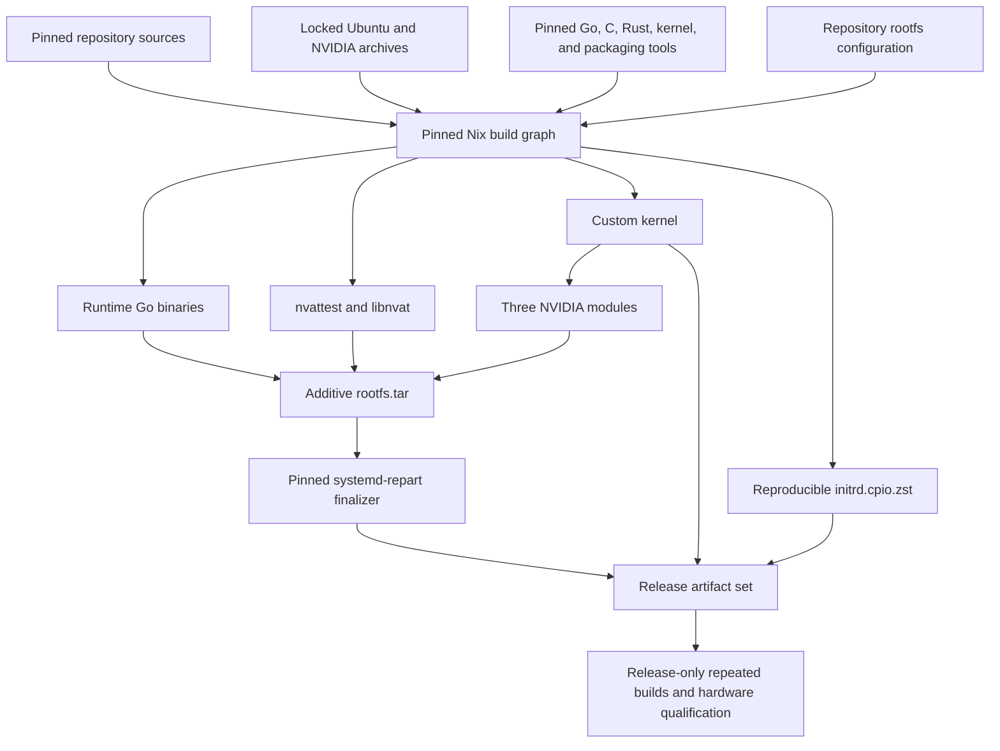

# Image build

Confidential virtual machine (CVM) means reduced trusted computing base (TCB).

Normally, when building a hardened image, the simplest approach is to start from something that works and remove all the crap. That is a subtractive approach. It is especially functional when making sure complex applications (like AI inference or training that leverage GPUs and complex drivers) can run at full speed.
The issue with a subtractive approach is that it makes the final image harder to audit. You basically need to trust us not to have forgotten to remove anything, and, when packages evolve or change after an update, that nothing fishy made it in.

We decided to try a different additive approach: we start from an empty image and declare everything that makes it in. That makes it trivial to audit our image and easier to later shrink the TCB even more.

The image is not assembled by scripts; it is declared. The repository
describes every input and every byte of the final image, and a single tool,
pure Nix, hermetically realizes that description. Nothing enters the image
implicitly: every outside input is pinned by hash, and the whole definition
is small enough (1,400 lines) to actually read.

Because the build is deterministic, the result is byte-for-byte reproducible:
anyone can rebuild the image from source, on their own machine, and obtain
exactly the artifacts we ship. That closes the loop that makes a confidential
VM trustworthy: the measurement a running enclave attests to traces all the
way back to public source code, not to our word or our build machines.

## Graph



This is intentionally kept simple: everything is built end-to-end in isolation, on a single builder.

## Nix ownership

The top-level `default.nix` pins Nixpkgs and assembles the declarations in
`inference/default.nix` and `sandbox/default.nix`. Each variant chooses its Go
module, command list, kernel fragments, package payloads, accounts, and files.
`nix/platform.nix` declares the shared libraries, network tools, configuration,
and initrd. `nix/variant.nix` combines these declarations using the generic Go,
rootfs, and image builders. Adding a variant does not require a new branch in
those builders.

The Go modules follow the same ownership. `tinfoil/` owns CPU boot, PID 1
supervision, and the TLS shim. Each takes a `Spec` with declared policy and
focused hooks. Command entry points parse arguments and own process exits;
the shared `Run` functions return errors. PID 1 derives readiness requirements
and hardening policy lookup from the service declarations, while each variant
keeps its startup and shutdown order explicit.

`inference/` owns GPU bootstrap, attestation and metrics, Docker,
containers, registry credentials, container networking, and diagnostics. `sandbox/` owns the workspace layout declaration, SSH, enrollment, and its CPU-only
configuration rules. `tinfoil/cmd/volumes` owns storage service startup and HTTP
handling. `tinfoil/internal/volume` owns activation, filesystem checks, formatting,
mounts, and resource lifetimes for both variants. Each module has
its own `go.mod` and checks; the two variants depend on `tinfoil/` through a
local module replacement. The coordinated schema checkout must be available at
`../tinfoil-config`; Go modules replace the schema dependency with that checkout.
Nix assembles both sources and accepts `--arg schemaSource /path/to/tinfoil-config`.
Update the platform vendor hash when schema implementation files change.

Boot compiles a workload declaration from verified configuration once. Each
variant chooses pack mount destinations, compatibility aliases, workload secret
names, and its device-evidence provider. Inference also supplies GPU attestation
and registry preparation hooks. Shared boot keeps the execution order, stage
reporting, and publication of configuration, certificate, and attestation files.

The implementation lives in focused internal packages:

| Package | Responsibility |
| --- | --- |
| `internal/modelpack` | Verified pack devices, key derivation, and mapping cleanup |
| `internal/volume` | Storage plans, activation, authenticated disks, filesystem checks, formatting, mounts, overlays, and cleanup |
| `internal/keyserver` | Attested challenge/fetch protocol using the provisioned certificate |
| `internal/secretstore` | Secret source rules, resolved values, subsets, and sealed handoff |
| `internal/identity` | Node keys and their attestation binding |
| `internal/attestation` | CPU evidence and attestation documents |
| `internal/tls` | Certificate provisioning and challenge handling |
| `internal/guestnet` | Guest interface configuration and resolver checks |
| `internal/runtimeconfig`, `internal/config` | Measured and external configuration loading |

Secret resolution returns a store without modifying external configuration.
Model keys stay available to boot; the child handoff contains only the variant's
requested workload secrets. Inference combines host and resolved credentials
locally for registry preparation and creates public bind-mount points for its
private packs.

`internal/bootstate` contains the stage tracker and common boot artifact paths;
inference's runtime paths live in `inference/internal/variant/paths.go`. Shared
hardening applies each service's declared device paths, and the shim accepts
configured evidence providers and HTTP handlers. Boot publishes the initial
shim config so observability can start before the workload. The inference
container manager replaces it when applying a reload.

All variants use the common `tinfoil-config` wire schema,
including its container and GPU fields. External metadata and token audience
and scope values also retain their existing protocol contracts. These are
compatibility boundaries; workload behavior belongs to the variant. Container
policy helpers and their validation tests are owned by inference.

NVIDIA builders, patches, the nvattest dependency lock, and NVIDIA and Docker
source pins live under `inference/nix/`. The shared `nix/runtime-sources.nix`
contains only the BusyBox debug payload. Each variant owns its measured
`rootfs/etc/nftables.conf`; shared firewall code only executes nft commands,
including the HTTP-01 rule used by boot.

Inference includes the NVIDIA payload and container runtime. Sandbox includes
`tinfoil-sandbox` and OpenSSH. Both include `tinfoil-volumes`, the shared ext4
tooling in `nix/storage.nix`, and the storage kernel fragment
`kernel/config.d/15-storage.config`. Both can mount ext4 and EROFS volumes on an
EROFS guest root. See [Shared storage](storage.md) for configuration and unlock flows. The producer
outputs below exist for each variant, with sandbox outputs prefixed
`sandbox-`; the initrd is shared.

| Output | Builder | Declaration |
| --- | --- | --- |
| Runtime and debug Go binaries | Nixpkgs `buildGoModule` | `nix/go.nix`, variant command lists, each module's `go.mod` and `go.sum` |
| Fixed initrd | Pinned GNU cpio and Zstandard | `nix/platform.nix`, `nix/initrd.nix` |
| Custom kernel | Nixpkgs `linuxManualConfig` | `nix/kernel.nix`, shared `kernel/` configuration, variant kernel fragments |
| Three NVIDIA modules | Nixpkgs kernel-module build | `inference/default.nix`, `inference/nix/nvidia-modules.nix` |
| nvattest and libnvat | Nixpkgs CMake and Rust builders | `inference/nix/nvattest.nix`, `inference/nix/patches/`, `inference/nix/locks/regorus.Cargo.lock` |
| Ubuntu package payloads | Nixpkgs `debClosureGenerator` and fixed-output fetches | `nix/platform.nix`, `sandbox/default.nix`, their package locks |
| NVIDIA and Docker payloads | Fixed-output archive fetches | `inference/default.nix`, `inference/nix/sources.nix` |
| Debug payloads | Fixed-output archive fetches | `nix/debug-rootfs.nix`, `nix/runtime-sources.nix` |
| Repository configuration | Explicit file manifests | `image/rootfs/`, `inference/rootfs/`, `sandbox/rootfs/` |
| Rootfs and debug archives | Fixed tar materializer | `nix/rootfs.nix`, shared and variant manifests |
| Shipping and debug disk images | Nix-owned fakeroot and `systemd-repart` | `nix/image.nix`, `repart.d/` |

Go binaries and Go validation use the same Nixpkgs Go 1.26 toolchain. The
three NixOS-only patches that prepend Nix-store paths for timezone, MIME, and
IANA databases are omitted so measured guest binaries retain upstream Linux
lookup paths and contain no Nix-store references. All other Nixpkgs Go patches
and the upstream `buildGoModule` machinery remain unchanged.

All builders — CI, release, operators, and auditors — install Nix through one
script, `nix/install.sh`, which lives beside the pin files it enforces. It
installs the official Nix 2.35.1 binary
release pinned by `nix/nix-version`, `nix/nix-x86_64-linux.sha256`, and the
expected Nix store path, and refuses a pre-existing, unverified Nix
installation. Every builder therefore uses the same official release
for both the client and daemon, with `sandbox = true`,
`sandbox-fallback = false`, `restrict-eval = true`, and
`allowed-uris = https://github.com/NixOS/nixpkgs/archive/`. A sandbox setup
failure therefore stops the build rather than changing its isolation boundary,
and the only network input permitted at evaluation time is the hash-pinned
Nixpkgs archive, so an unpinned evaluation-time fetch fails closed. The remaining host prerequisites
are an x86_64 Linux host with systemd, `sudo`, `curl`, `tar`, `xz`, and the
kernel features required by the Nix sandbox. GitHub runner images may float.
Artifact construction runs inside the Nix sandbox.

The pinned Nixpkgs source is imported with an empty configuration and no
overlays. Developer or machine-local Nixpkgs configuration is not part of the
build graph.

`nix/rootfs.nix` starts from an empty tree and applies the combined manifest
of package paths, Nix-built outputs, and repository files. Duplicate file
installs fail; intentional replacements must be declared separately. Package
archives are extracted into build-only staging trees; package maintainer
scripts do not run, and manuals, headers, service units, package helpers, and
other undeclared paths never enter the image. The Ubuntu package closure is
still the pinned source of runtime libraries and the CA bundle, but the
measured rootfs contains only its declared runtime payload. NVIDIA graphics,
video, OpenCL, host diagnostics, CUDA debugger and MPS tools, distro boot
integration, systemd units, Turing-only firmware, and legacy NVIDIA
runtime-hook compatibility are likewise excluded. The CUDA compute, CDI
container, attestation, firmware, and NVSwitch payloads remain.

The Nix expressions also reject store references in runtime binaries and use
fixed ownership, modes, archive ordering, and timestamps. Reproducibility is a
property demonstrated by repeated clean builds and cross-host comparison; it
is not inferred merely from using Nix.

## Image finalization

`nix/image.nix` extracts the rootfs and optional debug layer within one
fakeroot session, then invokes the pinned Nixpkgs `systemd-repart` directly.
It receives only:

- `rootfs.tar`;
- the debug rootfs layer for `debug-image`; and
- the fixed partition definitions and seed in `repart.d/`;
- the Nix-built kernel and initrd.

It performs no package installation or network access. The derivation creates
the root filesystem, partition table, dm-verity metadata, and one validated
artifact directory. Missing, duplicate, or malformed root-hash output fails
the build.

The disk contains only a fixed 2 GiB EROFS root partition and the exact
dm-verity hash partition calculated by `systemd-repart`. QEMU supplies the
kernel, initrd, and firmware directly, so the image has no empty ESP. The build
fails if the additive rootfs does not fit the fixed root partition.

## Build interface

The supported interface is the named Nix outputs:

```sh
nix-build -I . -A rootfs-archive -o result-rootfs
nix-build -I . -A inference-image -o result
nix-build -I . -A inference-debug-image -o result-debug
nix-build -I . -A sandbox-image -o result-sandbox
nix-build -I . -A sandbox-debug-image -o result-sandbox-debug
nix-build -I . -A checks
```

`shipping-image` and `debug-image` remain as aliases of the inference outputs.
Focused producer outputs such as `runtime-go`, `kernel-artifacts`,
`nvidia-modules`, `nvattest`, and `initrd` remain directly buildable; the
sandbox variant exposes `sandbox-runtime-go` and `sandbox-kernel-artifacts`,
and `sandbox-checks` vets and tests its Go module. `platform-checks` and
`inference-checks` cover the other modules; `checks` builds all three. The
platform checks also run the PID 1, boot-state, metrics, and shim race tests
and the debug-console tests. Inference checks run the NVML, GPU metrics, and
shim race tests. Sandbox checks race-test enrollment and workspace handling.
Both variants test their debug PID 1 builds. Dependency
checks inspect `go list -deps -test` for production and debug builds: shared
code cannot import either variant, the variants cannot import each other,
and shared code and sandbox cannot import the NVIDIA, Docker, Moby, or
containerd SDK namespaces. Schema dependencies for OCI references and digests
remain allowed. There is no task-runner layer. Deleting result symlinks or
collecting the Nix store is a separate host operation.

Regenerate the reviewed Ubuntu package locks only when changing package inputs
or snapshot indexes:

```sh
nix-build --option sandbox true -I . -A runtime-package-lock -o result-package-lock
cp --no-preserve=mode result-package-lock nix/runtime-packages-lock.nix
nix-build --option sandbox true -I . -A sandbox-package-lock -o result-package-lock
cp --no-preserve=mode result-package-lock sandbox/packages-lock.nix
rm result-package-lock
```


## Auditing the build

An audit answers three questions: what goes in, what comes out, and whether an
independent rebuild matches the published release. Each has a mechanical
check.

### 1. Reproduce the artifacts

On any x86_64 Linux host, check out the release commit and run
`nix/install.sh`. It downloads the pinned official Nix release,
verifies its checksum, installs it with the required sandbox and
restricted-evaluation settings, and asserts the result — CI and release
builders run the same script, so there is exactly one installation path.
The installer does not modify shell profiles, so put it on `PATH` and build:

```sh
export PATH="/nix/var/nix/profiles/default/bin:$PATH"
nix-build -I . -A inference-image -o result
```

Compare `sha256sum result/*` and the dm-verity root hash in
`result/tinfoilcvm.roothash` against the published release checksums and
manifest. Matching hashes mean the published artifacts are exactly what this
source tree produces; the root hash is also the value bound into runtime
attestation.

### 2. Enumerate every external input

Every external input of a target is a fixed-output derivation in its closure:
a fetch that declares its expected hash before the sandbox permits network
access. Enumerate them all, with their hashes, from the instantiated
derivation graph:

```sh
drv="$(nix-instantiate -I . -A inference-image)"
nix --extra-experimental-features nix-command derivation show -r "$drv" \
  | jq -r '.derivations | to_entries[]
      | select(.value.outputs.out.hash?)
      | [(.value.env.urls // .value.env.url // .value.name),
         .value.outputs.out.hash] | @tsv' \
  | sort -u
```

An empty hash column cannot occur: a derivation without a declared output
hash builds with no network access at all. Together with the hash-pinned
Nixpkgs source in `nixpkgs.lock.json`, this list is the complete set of bytes
that enter the build from outside the repository.

### 3. Review the declarations

The ownership table above maps each output to its declaration. Review the
manifests and their materializers together:

- `nix/platform.nix` declares the shared guest files and package paths.
- `inference/default.nix` and `sandbox/default.nix` declare each variant's
  additions. Their command lists determine both Go compilation and binary
  installation. A file under a rootfs source directory ships only when a
  manifest selects it.
- `nix/rootfs.nix` applies those manifests and fixes archive ownership and
  timestamps. `nix/debug-rootfs.nix` declares the debug additions.
- `nix/image.nix` receives the archives, kernel, initrd, and `repart.d/`
  definitions, then produces the partitioned image and root hash without
  network access or package installation.

To confirm the declarations match the output, list the built rootfs archive
directly:

```sh
nix-build -I . -A rootfs-archive -o result-rootfs
tar -tvf result-rootfs
```

Every entry traces to a declared package path, a Nix-built binary, or a
repository file. `nix-build -I . -A checks` runs the source checks. Building
the runtime and debug binary outputs also checks that they contain no
Nix-store references.

## Continuous integration

Pull-request CI always checks the pinned Nix installation and isolated Nixpkgs
evaluation. It compares the `platform-checks`, `inference-checks`,
`sandbox-checks`, `runtime-go`, `debug-pid1`, `initrd`,
`sandbox-runtime-go`, and `sandbox-debug-pid1`
derivation paths with the pull request's
base and builds only the changed outputs. Changes to the Nix installer or this
workflow build all of them. The
`initrd` output builds the initrd command and constructs the fixed archive with
the pinned GNU cpio implementation.

Pushes to `main`, and explicit manual runs, build `checks` and the four image
outputs on one runner. The image outputs transitively build shipping and
debug kernels, NVIDIA modules, nvattest, initrds, runtime binaries, and rootfs
archives without a second producer list. These workflows neither publish
artifacts nor qualify a release. Derivation comparison only schedules CI work; it is not an integrity
check or a release policy.
