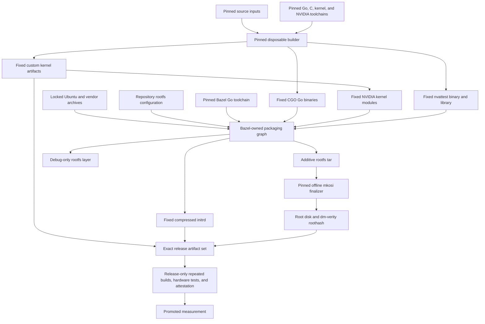

# Build boundary

The image build deliberately uses three tools with separate ownership. The
pinned disposable builder compiles artifacts that do not fit cleanly in Bazel,
Bazel assembles the measured filesystem inputs, and mkosi creates the final
root disk and dm-verity metadata.

This is a declarative, pinned build graph. It is not a claim that Bazel builds
the complete image, that every action is hermetic, or that Bazel itself proves
full-image reproducibility.

## Graph



There is no content-addressed artifact service between the builder and Bazel.
The builder publishes a small fixed set of worktree-local files, and Bazel
consumes those files as explicit packaging inputs.

## Ownership

### Pinned builder

`builder/Dockerfile` pins the Ubuntu base digest, dated package snapshot, and
build tool versions. `builder/run.sh` exposes only fixed producer names and
fixed output paths.

The builder owns:

- five CGO runtime commands: `tinfoil-boot`, `tinfoil-container-status`,
  `tinfoil-egress`, `tinfoil-init`, and `tinfoil-shim`;
- the custom kernel;
- the three NVIDIA modules described in `nvidia-module-producer.md`; and
- `nvattest` plus its required `libnvat` shared library.

The fixed handoff paths are:

| Producer output | Worktree path |
| --- | --- |
| CGO Go binaries | `build/builder-work/output/artifacts/` |
| Kernel | `kernel/out/` |
| NVIDIA modules | `kernel/out/rootfs-artifacts/nvidia-modules/` |
| nvattest | `build/rootfs-artifacts/nvattest/` |

Package installation and maintainer scripts may run in this environment. Its
filesystem is disposable and is never copied into the runtime image. Only the
named output files are eligible Bazel inputs. The NVIDIA producer alone uses
its documented build-time privileges.

Normal image builds require existing nvattest outputs because rebuilding them
is expensive. `make regenerate-nvattest` is the explicit producer operation.
There is no nvattest output digest protocol, artifact cache identity layer, or
second builder verifier.

### Bazel

Bazel owns:

- the pure-Go initrd command and fixed CPIO/Zstandard packaging action;
- resolution and extraction of the locked Ubuntu package closure;
- pinned Docker and NVIDIA userspace archives;
- rootfs paths, ownership, modes, links, and archive metadata;
- the additive rootfs tar;
- the debug-only rootfs layer; and
- focused Go and initrd tests.

`//image:rootfs` packages complete declared payloads, repository configuration,
and the fixed external producer outputs. Bazel does not compile the CGO runtime
commands, kernel, NVIDIA modules, or nvattest, and it does not create the final
disk image.

Runtime package updates use the upstream resolver directly:

```sh
bazel run @ubuntu_runtime//:lock
```

`MODULE.bazel.lock` is updated separately when Bazel module dependencies change.

### mkosi

mkosi consumes `build/stage/bazel-rootfs.tar` in offline custom-distribution
mode. It owns only disk formatting, the fixed partition layout, dm-verity
metadata, and the root-disk output. It does not resolve packages, compile
sources, or copy a builder filesystem.

The kernel and initrd are not embedded by mkosi. They are published beside the
root disk as separate platform inputs.

### Make

Make is only the human-facing interface and visible ordering between owners:

```sh
make rootfs
make shipping-image
make debug-image
make test
make regenerate-nvattest
make clean
```

It contains no package resolver, manifest language, filesystem parser, output
authentication protocol, or hidden internal target graph.

`make shipping-image` publishes:

- `tinfoilcvm.raw`;
- `tinfoilcvm.roothash` and its compatibility copy `tinfoilcvm.hash`;
- `tinfoilcvm.vmlinuz`; and
- `tinfoilcvm.initrd`.

`make debug-image` uses the same release kernel and initrd with the compile-time
debug PID1 and pinned static shell described in `debug-image.md`. Its distinct
measurement is diagnostic and must not be promoted.

## Reproducibility and release qualification

External inputs and output-sensitive tools are pinned, and each artifact owner
normalizes the metadata it controls. These properties support reproducible
builds, but no individual tool proves that the complete image is reproducible.
A Bazel sandbox also does not make the external builder or privileged mkosi
steps hermetic.

Routine PR and release CI perform one ordinary build. Promotion is a protected,
release-only process using two isolated builds, `sha256sum` and `cmp`, optional
`diffoscope` on mismatch, functional boot and workload tests, hardware-specific
GPU qualification, attestation, approval, and promotion of the exact qualified
measurement.

The threat model accepts build-time disruption and denial of service. A broken
or malicious builder may prevent a release, but it must not make an unapproved
measurement pass runtime attestation.
